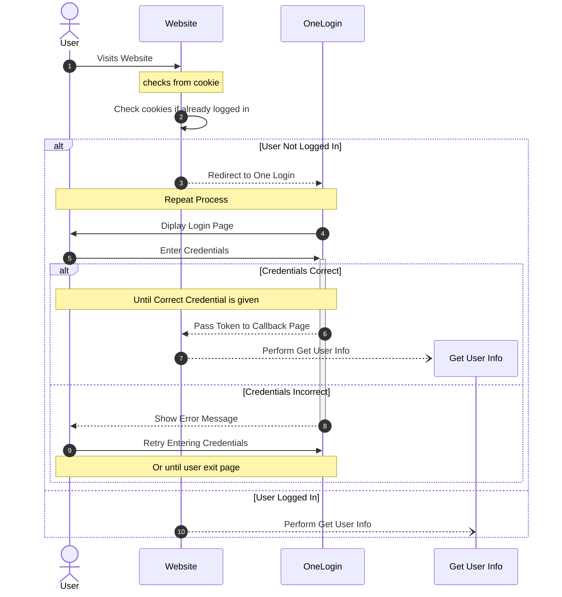
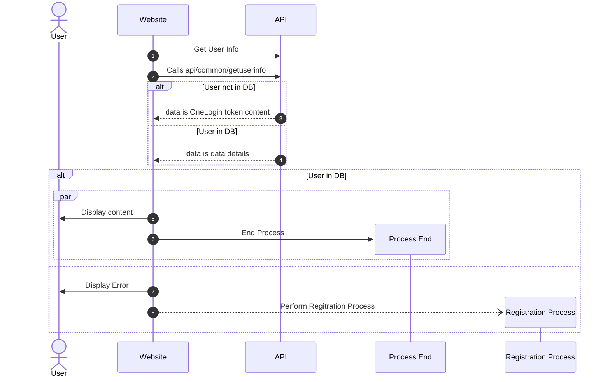
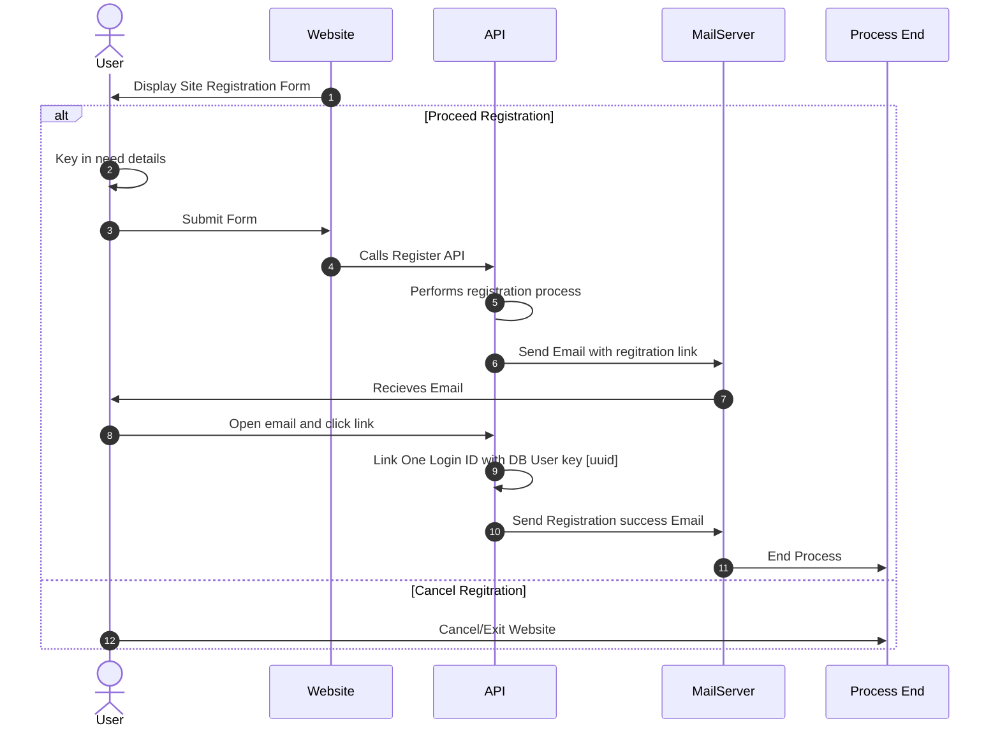

## Login Process

## Get User Info

## Regitration Process

[1]:https://chatgpt.com/
[2]:https://www.datacamp.com/cheat-sheet/markdown-cheat-sheet-23
[3]:https://mermaid.js.org/syntax/sequenceDiagram.html
